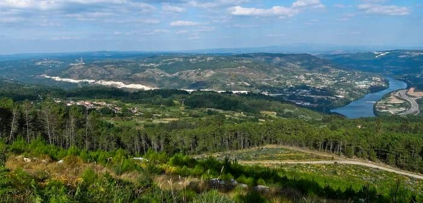

---
# Pandoc header, everything that is inserted here is only for the computer to know what and how to compile the output. 
title: |
  {width=1.5in}  
  Evaluación económica de alternativas selvícolas para masas de *Pinus pinaster* subsp. _atlantica_  
shorttitle: 'Informe para el proyecto SIGCA'  
author: "Cristóbal Ordóñez & Felipe Bravo"  
date: |
  "`r Sys.Date()`"  
  ·  
  {width=2in}  
  {width=2in}
linestretch: 1.5                 # get some spacing between the lines you write
bibliography: report.bib         # this is your bibliography file... it can be exported with Zotero, Medeley...
biblio-style: apalike            # citations style
link-citations: yes              # make your links clickable
output: 
  bookdown::pdf_document2:       # bookdown::pdf_document2 provides more features than pdf_document
    number_sections: true        # chapters will be assigned numbers automatically
    fig_caption: yes
    tab_caption: yes
    keep_tex: true
#    includes:
#      in_header: preamble.tex    # here goes the tex file for first page and othe latex options (your name, university, ..., and LaTex packages)
#      before_body: before_body.Rmd # include pages before the main part of the document in the following order 
documentclass: book
header-includes:
  - \usepackage{float}
  - \usepackage{longtable}
  - \usepackage[spanish]{babel}
  - \usepackage{eurosym}
#  - \floatsetup[table]{capposition=top}
---

\tableofcontents

# Introducción y marco del informe
En el presente informe se muestra el resultado de la valoración económica de diversas alternativas selvícolas planteadas para masas de *Pinus pinaster* en el marco del proyecto del Grupo Operativo SIGCA para madera de calidad de esta especie.

```{r, include=FALSE}
## before you compile the document. This may show additional messages to help you debug the problem. If you are using R Markdown and the Knit button in RStudio, you should set the option in a code chunk in the R Markdown document.
options(tinytex.verbose = TRUE)
```

```{r setup, include=FALSE}
## setup options and library loading
knitr::opts_chunk$set(echo = FALSE, cache=FALSE)
library(plyr); library(pander); library(ggplot2); library(reshape2); library(ggforce); library(dplyr); library(viridis)
panderOptions('table.alignment.default', 'right')
panderOptions('table.alignment.rownames', 'left')

## colors
# The palette with grey:---->>>> cbPalette <- c("#999999", "#E69F00", "#56B4E9", "#009E73", "#F0E442", "#0072B2", "#D55E00", "#CC79A7")
# The palette with black:---->>>> cbbPalette <- c("#000000", "#E69F00", "#56B4E9", "#009E73", "#F0E442", "#0072B2", "#D55E00", "#CC79A7")
# To use for fills, add: ---->>>> scale_fill_manual(values=cbPalette)
# To use for line and point colors, add: ---->>>> scale_colour_manual(values=cbbPalette)
## colors
```

```{r read.data, include=FALSE}
## read simulation data
rm(list=ls())
## options(width=280)
## setwd('/home/cristobal/Disk.IUGFS/proyectos/2019.go.sigca/evaluacionEconomica')
data.simul <- read.csv('./simulaciones.2.csv')
data.simul$Calidad <- as.factor(data.simul$Calidad)
data.simul$Zona <- with(data.simul, ifelse(Zona==0, 'zona interior', 'zona costera') )
```

## Objetivos

```{r img.pinaster, fig.align='center', out.width="750px"}

```

El objetivo principal de este trabajo es describir la rentabilidad de cuatro alternatívas selvícolas, con diferentes productos potenciales y teniendo en cuenta la zona de plantación (interior o costa) y la calidad de estación, bajo dos escenarios de precios del dinero y dos escenarios de precios de los productos madereros.

## Alternativas selvícolas

A continuación se describen las características de las cuatro alternativas selvícolas teóricas que se han comparado.

  1. M2 - Estándar habitual
 * Objetivo de gestión: Troncos de 1 a 1,2 m^3^
 * Preparación del terreno: Laboreo en líneas. Fertilización.
 * Composición del rodal: Monoespecífica
 * Estructura del rodal: Masa regular
 * Material genético: Plantas genéticamente mejoradas.
 * Tipo de regeneración: Plantación a 1250 pies/ha
 * Clareo y control de la competencia: Desbroce completo a los 5 años y siempre que haya una intervención (4-5 veces con las claras)
 * Claras/Podas: 3 claras. Sin podas.
 * Aprovechamiento: 40 años; 300 pies/ha

2. M4 - Turno corto con subsídios
 * Objetivo de gestión: Troncos pequeños de 0,3 a 0,4 m^3^
 * Preparación del terreno: Laboreo completo. Fertilización.
 * Composición del rodal: Monoespecífica
 * Estructura del rodal: Masa regular
 * Material genético: Plantas genéticamente mejoradas
 * Tipo de regeneración: Plantación a 1250 pies/ha
 * Clareo y control de la competencia: Desbroce completo a los 5 años.
 * Claras/Podas: 1 clara. Sin podas.
 * Aprovechamiento: 25 años; 700 pies/ha

  3. M8 - Sin gestión
 * Objetivo de gestión: Sin objetivos productivos
 * Preparación del terreno: No
 * Composición del rodal: Mixta
 * Estructura del rodal: Masa irregular
 * Material genético: No.
 * Tipo de regeneración: Regeneración natural.
 * Clareo y control de la competencia: No
 * Claras/Podas: No
 * Aprovechamiento: Errático.

  4. MG2-Madera para trituración, sierra y chapa
 
 * Objetivo de gestión: Optimizar la producción económica del monte 400-500 pies de calidad para madera sólida en la corta final
 
 * Preparación del terreno: Ahoyado mecanizado o subsolado lineal en máxima pendiente levantando el subsolador en la linea para evitar surcos de escorrentía. Ejecución en tiempo seco, dos meses de antelación a la plantación. Raspas picadas de 40x40x20 cm
 
 * Composición del rodal: Monoespecífico
 
 * Estructura del rodal: Masa regular
 
 * Material genético: Preferiblemente mejorado o rodal selecto de origen la región de procedencia en que se incluya el monte a repoblar y excepcionalmente de otras regiones de procedencias si tiene algún nivel de mejora.
 
 * Tipo de regeneración: Plantación a raíz desnuda a savia parada (finales de octubre a marzo) y con envase hasta mayo si hay tempero. Plantación con barra para asegurarse la colocación de la planta recta. Fertilizado NPK bajo en nitrógeno y liberación gradual. También se plantea la opción de regeneración natural.
 
 * Clareo y control de la competencia: 8-10 años. dejar 1000-1200 pies/ha por lo bajo (sobre árboles dominados y con defectos), o si es regenerado natural a 2-5 años clareo-desbroce sistemático por fajas y selectivo dentro de la faja que queda hasta densidad de 1000 a 1400 pies/ha, de forma escalonada si hay problema de viento fuerte o densidad inicial muy elevada. Y mantenimiento entre líneas de plantación y manual o químico en las plantas, o con ganado.
 
 * Claras/Podas: 1ª Clara hasta dejar 1000 pies/ha a 15-20 años. 2ª clara a  20-30 años  hasata dejar 400-500 pies/ha y 700 pies/ha si hay otra clara. Poda baja (3 m) cuando la altura es de 5-7 m y el diámetro normal medio de 10 cm en los 100-1200 pies/ha  restantes tras clareo. Poda alta hasta 6 m (si no hay poda natural) cuando los pies alcancen 12-15 m y diámetro normal de 18 cm sobre 400-500 pies/ha que se dejarán en la corta final. Intensidades de poda entre 1/3 y 1/2 de la altura total del árbol. 3ª Clara opcional hasta dejar 400-500 pies/ha (25-35 años)
 
 * Aprovechamiento: A 30-35 años a hecho o en 2 tiempos (árboles madre 20-25 pies/ha) durante 5-10 años sin hacer corta a hecho en superficies superiores a 5 ha. Trituración de restos mecanizado (no mayores de 50 cm) y esparcimiento dejando un mínimo del 30% de restos para impactar en el ciclo de nutrientes.

## Simulaciones selvícolas

Los escenarios descritos se han simulado según el modelo de crecimiento elaborado por @Dieguez2009, y dentro del trabajo del Grupo Operativo SIGCA. 
Los resultados de la simulación parten del año 0 de la planta y tienen en cuenta la calidad de estación, tomada como la altura dominante en metros a la edad de 20 años, y el área geográfica de Galicia en el que se desarrolla, interior o costa.

A continuación se muestran los datos de las simulaciones, representados por la evolución de volumen de madera producida, para cada uno de los escenarios selvícolas, zona y calidad de estación. 

### Evolución de volumen producido de madera de calidad.

Dado que el objetivo del grupo operativo esta centrado en la producción de madera de calidad, se ha simulado de forma separada la que puede destinarse a industrias que suponen un mayor valor añadido, considerando como tal el volumen, en m^3^/ha, de madera procedente de trozas de más de 20 cm de diámetro en punta delgada. 

```{r plot.vol.gross M2, fig.pos = 'H', fig.height=5, fig.width=13, fig.align='center', fig.cap='Volumen total de madera de más de 20 cm en punta delgada, Régimen selvícola M2' }
## gráficas volumen madera total por calidades y escenarios de gestión
ggplot(data = data.simul[data.simul$RegimenClara=='M2',],
       aes( x= Edad, y=VCC20,
           group = Calidad, colour = Calidad )) +
    geom_line() + facet_grid( ~ Zona) +
    labs( x = 'Edad (años)', y = 'Volumem (m^3^/ha)'## ,
         ## title = 'Volumen total de madera de más de 20 cm en punta delgada / Régimen selvícola M2'
         )
```

```{r plot.vol.gross M4, fig.pos = 'H', fig.height=5, fig.width=13, fig.align='center', fig.cap='Volumen total de madera de más de 20 cm en punta delgada, Régimen selvícola M4'}
## gráficas volumen madera total por calidades y escenarios de gestión
ggplot(data = data.simul[data.simul$RegimenClara=='M4',],
       aes( x= Edad, y=VCC20,
           group = Calidad, colour = Calidad )) +
    geom_line() + facet_grid( ~ Zona) +
    labs( x = 'Edad (años)', y = 'Volumem (m^3^/ha)'## ,
         ## title = 'Volumen total de madera de más de 20 cm en punta delgada / Régimen selvícola M4'
         )
```

```{r plot.vol.gross M8, fig.pos = 'H', fig.height=5, fig.width=13, fig.align='center', fig.cap='Volumen total de madera de más de 20 cm en punta delgada, Régimen selvícola M8'}
## gráficas volumen madera total por calidades y escenarios de gestión
ggplot(data = data.simul[data.simul$RegimenClara=='M8',],
       aes( x= Edad, y=VCC20,
           group = Calidad, colour = Calidad )) +
    geom_line() + facet_grid( ~ Zona) +
    labs( x = 'Edad (años)', y = 'Volumem (m^3^/ha)'## ,
         ## title = 'Volumen total de madera de más de 20 cm en punta delgada / Régimen selvícola M8'
         )
```

```{r plot.vol.gross MG2, fig.pos = 'H', fig.height=5, fig.width=13, fig.align='center', fig.cap='Volumen total de madera de más de 20 cm en punta delgada, Régimen selvícola MG2'}
## gráficas volumen madera total por calidades y escenarios de gestión
ggplot(data = data.simul[data.simul$RegimenClara=='MG2',],
       aes( x= Edad, y=VCC20,
           group = Calidad, colour = Calidad )) +
    geom_line() + facet_grid( ~ Zona) +
    labs( x = 'Edad (años)', y = 'Volumem (m^3^/ha)'## ,
         ## title = 'Volumen total de madera de más de 20 cm en punta delgada / Régimen selvícola MG2'
         )
```

### Evolución de volumen total de madera producida.

Para hacer una valoración económica global se hace necesario tener en cuenta todos los productos de madera posibles, incluidos los de menor calidad, por lo que también se ha simulado la evolución del volumen aprovechable total, es decir, aquel que tiene de más de 7 cm en punta delgada. 

En las siguientes gráficas se muestra la evolución teórica del volumen total aprovechable en los diferentes escenarios selvícolas.

```{r plot.vol.total M2, fig.pos = 'H', fig.height=5, fig.width=13, fig.align='center', fig.cap='Volumen total de madera de más de 7 cm en punta delgada, Régimen selvícola M2'}
## gráficas volumen madera fina por calidades y escenarios de gestión
ggplot(data = data.simul[data.simul$RegimenClara=='M2',],
       aes( x= Edad, y=VCC7,
           group = Calidad, colour = Calidad )) +
    geom_line() + facet_grid( ~ Zona) +
    labs( x = 'Edad (años)', y = 'Volumem (m^3^/ha)'## ,
         ## title = 'Volumen total de madera de más de 7 cm en punta delgada / Régimen selvícola M2'
         )
```

```{r plot.vol.total M4, fig.pos = 'H', fig.height=5, fig.width=13, fig.align='center', fig.cap='Volumen total de madera de más de 7 cm en punta delgada, Régimen selvícola M4'}
## gráficas volumen madera fina por calidades y escenarios de gestión
ggplot(data = data.simul[data.simul$RegimenClara=='M4',],
       aes( x= Edad, y=VCC7,
           group = Calidad, colour = Calidad )) +
    geom_line() + facet_grid( ~ Zona) +
    labs( x = 'Edad (años)', y = 'Volumem (m^3^/ha)'## ,
         ## title = 'Volumen total de madera de más de 7 cm en punta delgada / Régimen selvícola M4'
         )
```

```{r plot.vol.total M8, fig.pos = 'H', fig.height=5, fig.width=13, fig.align='center', fig.cap='Volumen total de madera de más de 7 cm en punta delgada, Régimen selvícola M8'}
## gráficas volumen madera fina por calidades y escenarios de gestión
ggplot(data = data.simul[data.simul$RegimenClara=='M8',],
       aes( x= Edad, y=VCC7,
           group = Calidad, colour = Calidad )) +
    geom_line() + facet_grid( ~ Zona) +
    labs( x = 'Edad (años)', y = 'Volumem (m^3^/ha)'## ,
         ## title = 'Volumen total de madera de más de 7 cm en punta delgada / Régimen selvícola M8'
         )
```

```{r plot.vol.total MG2, fig.pos = 'H', fig.height=5, fig.width=13, fig.align='center', fig.cap='Volumen total de madera de más de 7 cm en punta delgada, Régimen selvícola MG2'}
## gráficas volumen madera fina por calidades y escenarios de gestión
ggplot(data = data.simul[data.simul$RegimenClara=='MG2',],
       aes( x= Edad, y=VCC7,
           group = Calidad, colour = Calidad )) +
    geom_line() + facet_grid( ~ Zona) +
    labs( x = 'Edad (años)', y = 'Volumem (m^3^/ha)'## ,
         ## title = 'Volumen total de madera de más de 7 cm en punta delgada / Régimen selvícola MG2'
         )
```

Los datos de estas simulaciones serán utilizados como base para el cálculo de la rentabilidad económica de las masas sometidas a cada una de las alternativas selvícolas descritas, siempre ajustandose a la calidad de estación correspondiente al monte indicado.

## Marco del análisis

El marco de la presente evaluación ha considerado los siguientes factores: i) diferentes destinos de la madera según calidad y dimensión, ii) diferentes alternativas de gestión, iii) diferentes escenarios de precios de la madera considerando cinco destinos del producto, iv) gastos fijos de plantación y clareos, y gastos variables en función de las operaciones realizadas, y v) distintos precios del dinero.

### Destinos posibles de la madera
Para la clasificación de la madera según su uso potencial y por lo tanto el precio que se puede conseguir por la madera, se ha utilizado la adaptación realizada por AGRESTA S.Coop. de la la norma UNE EN 1927-2:2008. Basandose en criterios de dimensiones mínimas, se distinguen 5 calidades de madera posibles:

#### Calidad A
Trozas de calidad elevada cuyo destino habitual es chapa o carpintería de alta calidad. Las dimensiones mínimas son 3 m de longitud y 45 cm de diámetro.

#### Calidad B
Trozas de buena calidad cuyo destino habitual es sierra de calidad alta, carpintería de segunda calidad o tabla. Las dimensiones mínimas son 2,5 m de longitud y 40 cm de diámetro.

#### Calidad C
Trozas rectas con nudos (no demasiados) y hasta 30 cm de diámetro cuyo destino habitual es sierra de calidad media: vigas, viguetas, machones y tablas. Las dimensiones mínimas son 2,5 m de longitud y 25 cm de diámetro.

#### Calidad D
Trozas curvadas y con nudos cuyo destino habitual es sierra de baja calidad, encofrado y canter. Las dimensiones mínimas son 2 m de longitud y 20 cm de diámetro (18 para canter).

#### Calidad E
Trozas no aptas para sierra por defectos graves o diámetro insuficiente cuyo destino habitual es combustible o trituración. No hay dimensiones mínimas.

### Precios de la madera
Para el precio de la madera se han considerado 2 escenarios diferentes, dependientes de las calidades de los diferentes tipos de producto que permitan hacer una evaluación de los diferentes itinerarios selvícolas planteados en proyecto SIGCA:

#### Escenario 1
Los precios de la madera de “baja calidad”, similares a los actuales o suben ligeramente, los precios de madera de calidad bajan a medida que ascendemos de calidad

#### Escenario 2
Los precios de la madera de “baja calidad” suben y los de madera de calidad también suben.

Precios estimados medios de madera en pie que se han testado son:

```{r prices}
calidad_A <- c( 120, 0, 150, 0 )
calidad_B <- c(  50, 0,  65, 0 )
calidad_C <- c(  28, 0,  40, 0 )
calidad_D <- c(  20, 0,  24, 0 )
calidad_E <- c(  12, 0,  18, 0 )
Escenario <- c(  'Esc.1', 'Esc.2', 'Esc.3', 'Esc.4' )
df.precios <- data.frame( calidad_A, calidad_B, calidad_C, calidad_D, calidad_E )
row.names(df.precios) <- Escenario
df.precios.A2D <- df.precios[,c(1:4)]
df.precios.E <- df.precios[,c(5)]

pander(df.precios[c(1, 3),], caption='Precios de los diferentes destinos en Eur')
```

En cargadero habría que sumar unos 12 \euro/Mg. Hay que tener en cuenta que cuanto más delgada es la madera que se aproveche más cara será la corta y el desembosque, pero también hay que tener en cuenta que en las primeras claras se cuenta con la ventaja de abrir calles lo que permiten ahorrar costes. Por este motivo podemos suponer este coste como valor medio para todas. Si tenemos en cuenta que las unidades con las que vamos a trabajar, por la simulación realizada, son m^3^, necesitamos estimar la densidad de madera verde. Vamos a suponer que está en valores de 0,88 Mg/m^3^, por lo que el precio en cargadero debería aumentarse en 10,56 \euro/m^3^.

### Gastos de gestión

En el presente estudio se han tenido en cuenta dos tipos de gastos, los fijos que dependen de la superficie tratada y los variables que dependen de la producción obtenida. Para estos dos tipos de gastos se suponen las siguientes cuantías:

1. Gastos fijos. Son así considerados los que dependen de la superficie y pueden ser:

* Gasto de plantación, que supone un unos 2200 \euro/ha plantada, y se asigna al año 1, ya que suponemos que la planta es de 1 savia. Habría que sumar entre 250 y 300 \euro/ha si se utilizase planta mejorada genéticamente.

* Gasto de clareos, que incluye el calleado, clareo manual y trituración de restos, y supone unos 1100 \euro/ha tratada. La apertura de calles (roza mecanizada tractor de cadenas) en el año cuarto o quinto suponen 268 \euro/ha y la selección de pies en las calles (clareo o rareo) manual con motodesborzadora hasta ajustar denisdades a 1100 pies/ha supone 837 \euro/ha (inlcuye posterior triturado de restos en las calles, mecanizado mediante martillos)

2. Gastos variables. Son los que dependen de la cantidad de madera aprovechada. Se supone que el gasto medio del aprovechamiento es de 12 \euro/Mg que suponiendo que tiene un densidad de unos 0,88 Mg/m^3^ tiene un coste de 10,56 \euro/m^3^ 


```{r Densidad de la madera}
## https://www.forestalmaderero.com/articulos/item/tabla-de-densidad-de-maderas.html -->
## Nombre vulgar  Nombre científico       Madera verde Madera seca -->
##  Pino marítimo  Pinus pinaster                  ~880         540 -->
##  Palo de leche  Sebastinia brasiliensis          890         545 -->
```

### Subvenciones

Para soportar la inversión inicial de establecimiento y tratamientos no autofinanciados es habitual que se puedan solicitar ayudas a las entidades autonómicas correspondientes. En el caso que nos atañe, por ser donde son más habituales estas plantaciones, nos vamos a fijar en las bases de ayudas de Galicia en 2019 (@xunta2019). Según los tratamientos realizados se pueden solicitar ayudas por:

* plantación: coniferas 1100 pies/ha dificultades medias: 1527 \euro/ha
* poda: poda baja hasta 2,20 m en 800 pies/ha: 650 \euro/Ha
* Clareos: reducción de densidad 30%, selección de pies menos desarrollados, sin apertura de calles ni saca, mediante motosierra. 850 \euro/ha
* otras actuaciones posibles por las que se puede solicitar subvención: 
	+ desbroces por calles: 268 \euro/ha
	+ perimetros de cortafuegos: 350 \euro/ha
	+ fajas auxiliares de desbroce frente a incendios: 378 \euro/ha

En el estudio realizado se van a suponer dos ingresos posibles por subvención:

1. El que corresponde por plantación. Se supone un ingreso por subvención en el año 3, dos años después de la solicitud, y una cuantía de 1527 \euro/ha plantada que se aplica a todos los escenarios selvícolas salvo a MG2 con regeneración natural.

2. El que corresponde por clareos precomerciales. Este tratamiento solo se realiza en masas con regeneración natural, y que corresponde exclusivamente a MG2rn. En este escenario se incluye el ingreso de subvención por clara, que se realiza en el año 5 y tiene efecto dos años después de solicitarla, en el año 7, y por una cuantía de 850 \euro/ha aclarada.


### Tasa de descuento e interés aplicado.

Además se va a realizar una comparación del valor esperado del suelo (@DiazBalteiro1998) para cada una de las alternativas.

Según el @BE_sf, el precio del dinero o interés legal desde 2016 hasta 2020 se ha mantenido en un 3%, en los últimos debido a la prórroga de los Presupuestos Generales. 
En el análisis de una inversión se analizan los flujos de ingresos y gastos futuros con sus valores en el momento actual, para lo que hay que utilizar una tasa de descuento o coste del capital. El valor que se utiliza para esta tasa es muy controvertido (Ver @DiazBalteiro1998) y afecta de forma muy importante en el resultado del análisis de una inversión.

y escenarios de precio del dinero

según el @BE_sf, el precio del dinero o interés legal desde 2016 hasta 2020 se ha mantenido en un 3%, en los últimos debido a la prórroga de los Presupuestos Generales. 

En el análisis económico se prevé que pueda existir una variación por lo que se analizará para el caso de que suba o baje en un punto el precio del dinero, mostrando la actualización de las rentas suponiendo que sea un 2% y un 4%.

```{r interes.rate, include=FALSE}
v.tasa.interes <- c( 2/100, 4/100, 3/100 ) ### https://clientebancario.bde.es/pcb/es/menu-horizontal/productosservici/relacionados/tiposinteres/guia-textual/tiposinteresrefe/Tabla_tipos_de_interes_legal.html

### Estadísticas INE del IPC y del interés de bonos a largo plazo 10 - 15 años
### https://www.bde.es/webbde/es/estadis/infoest/indeco.html


v.tasa.interes <- c( 2/100, 3/100, 4/100 ) ### https://clientebancario.bde.es/pcb/es/menu-horizontal/productosservici/relacionados/tiposinteres/guia-textual/tiposinteresrefe/Tabla_tipos_de_interes_legal.html

## https://es.wikipedia.org/wiki/Tasa_de_descuento
## https://en.wikipedia.org/wiki/Discounted_cash_flow 
```

# Análisis económico

Este análisis pretende comparar el rendimiento económico de las distintas alternativas selvícolas planteadas, y para intentar conseguirlo vamos a seguir dos enfoques; El primero comparará el valor actual de ingresos y gastos generados en un único turno, presentado de forma gráfica para facilitar las comparaciones. En segundo lugar se realizará una valoración del monte, suponiendo que se van a realizar plantaciones de manera indefinida, lo que permitira obtener una renta que será independiente del turno y podremos comparar mediante una serie de tablas.

Para todo el anális tendremos en cuenta el valor de mercado del vuelo, prescindiendo del valor del suelo, y solo el relativo a la producción primaria directa (Principalmente madera, y madera de pequeño tambaño o leñas). Además se considerará un caso genérico, con valores medios para todas las variables, y el valor económico estará siempre referido a la hectárea. 
Para todo el anális tendremos en cuenta el valor de mercado del vuelo, actualizado al momento de la plantación, prescindiendo del valor del suelo, y solo el relativo a la producción primaria directa (Principalmente madera, y madera de pequeño tambaño o leñas). Además se considerará un caso genérico, con valores medios para todas las variables, y el valor económico estará siempre referido a la hectárea. 


## Descripción cuantitativa de las alternativas selvícolas
De forma complementaria se ha realizado una comparación del Valor Esperado del Suelo (@DiazBalteiro1998) para cada una de las alternativas selvícolas y condiciones de la estación. En esta valoración, indicada para masas regulares no ordenadas, nos va a permitir comparar las distintas opciones selvícolas independientemente del turno de las mismas.


##  Alternativas selvícolas

Se han considerado las cuatro alternativas de gestión descritas anteriormente. Para cada una de ellas se ha supuesto que hay un porcentage de madera que puede ir destinado a cada calidad en cada una de las intervenciones previstas. Se supone que toda la madera que se aproveche y tenga entre 7 y 20 cm en punta delgada será considerada de calidad E.

Con las proporciones de cada calidad se puede calcular el precio medio que tendrá la madera, suponiendo que su destino es el mejor de los posibles. Podemos calcular, para cada escenario de precios, el precio de la madera gruesa (VCC20) y el de la madera fina (VCC7).

```{r data.volume, include=FALSE}
## load volume of harvested data
data.volume <- read.csv('./simulaciones.vol.2.csv')
data.volume$Zona <- with(data.volume, ifelse(Zona==0, 'zona interior', 'zona costera') )
gasto.clara <- 10.56
```
### Escenario selvícola estándar habitual (M2)
```{r M2}

################################## simulación M2 ##################################
### se supone planta de 1 año
### 1 plantacion 1250
### 3 cobro subvención por plantación
### 14 clara 1000
### 22 clara 700
### 30 clara 300
### 40 corta final

edad.int <- c( 1, 3, 14, 22, 30, 40) # 6 momentos
turno <- max(edad.int)

costes.fijos <- c( 2200, 0, 0, 0, 0, 0 ) # \Eur/ha
costes.variables <- c( 0, 0, 1, 1, 1, 1 ) # \Eur/m3
costes.variables <- costes.variables * gasto.clara
ing.fijos <- c( 0, 1527, 0, 0, 0, 0 ) # \Eur/ha plantada
df.M2.i.fijos <- data.frame( 'M2', edad.int, ing.fijos )
names(df.M2.i.fijos)[c(1)] <- "RegimenClara"

proporcion_A <- c( 0, 0, 0, 0, 0,    0.07 ) # proporcion de VCC20
proporcion_B <- c( 0, 0, 0, 0, 0.28, 0.53 )
proporcion_C <- c( 0, 0, 0, 0, 0.29, 0.2 )
proporcion_D <- c( 0, 0, 1, 1, 0.43, 0.2 )

proporcion_E <- c( 0, 0, 1, 1, 1, 1 ) # Todo VCC7

df.M2.c.fijos <- data.frame( "M2", edad.int, costes.fijos )
names(df.M2.c.fijos)[c(1)] <- "RegimenClara"

df.M2.c.variables <- data.frame( "M2", edad.int, costes.variables )
names(df.M2.c.variables)[c(1)] <- "RegimenClara"

df.M2.proporcion <- data.frame( proporcion_A, proporcion_B, proporcion_C, proporcion_D )

M2.i.variables.Esc1.VCC20 <- as.matrix( df.M2.proporcion ) %*% t( as.matrix( df.precios[c(1), c(1:4) ] ) )
M2.i.variables.Esc1.VCC7  <- as.matrix( proporcion_E )     %*% t( as.matrix( df.precios[c(1), c(5)   ] ) )
M2.i.variables.Esc2.VCC20 <- as.matrix( df.M2.proporcion ) %*% t( as.matrix( df.precios[c(3), c(1:4) ] ) )
M2.i.variables.Esc2.VCC7  <- as.matrix( proporcion_E )     %*% t( as.matrix( df.precios[c(3), c(5)   ] ) )

df.M2.i.variables <- data.frame( "M2", edad.int, M2.i.variables.Esc1.VCC20, M2.i.variables.Esc1.VCC7, M2.i.variables.Esc2.VCC20, M2.i.variables.Esc2.VCC7, turno)

names(df.M2.i.variables)[c(1,3:7)] <- c( "RegimenClara", "E1_VCC20", "E1_VCC7", "E3_VCC20", "E3_VCC7", "turno")
rownames(df.M2.i.variables) <- c('plantacion', 'subvención', 'clara 1000', 'clara 700', 'clara 300','corta final')
rownames(df.M2.proporcion) <- c('plantacion', 'subvención', 'clara 1000', 'clara 700', 'clara 300','corta final')
```

En el escenario selvícola M2 tendremos aprovechamiento de madera en 3 claras y en la corta final. Se indica en el  Cuadro 2.1 
la proporción de volumen de madera esperable  para cada calidad y en el  Cuadro 2.2 los precios según cada escenario.

```{r M2 proporciones}
pander(df.M2.proporcion[c(3:6),]*100,
       caption= 'Proporciones de madera (%) por calidades en el escenario M2')
```

```{r M2 precios}
pander(df.M2.i.variables[c(3:6), c(2:6)],
       caption= 'Precios por escenario de precios y tamaño de madera el escenario selvícola M2')
```

### Escenario selvícola turno corto con subsidios (M4)
```{r M4}

################################## simulación M4 ##################################
### se supone planta de 1 año
### 1 plantacion 1250
### 3 cobro subvención por plantación
### 15 clara 700
### 25 corta final

edad.int <- c( 1, 3, 15, 25)
turno <- max(edad.int)

costes.fijos <-  c( 2200, 0, 0, 0 ) # \Eur/ha
costes.variables <- c( 0, 0, 0, 1 ) # \Eur/m3
costes.variables <- costes.variables * gasto.clara
ing.fijos <- c( 0, 1527, 0, 0 ) # \Eur/ha plantada
df.M4.i.fijos <- data.frame( 'M4', edad.int, ing.fijos )
names(df.M4.i.fijos)[c(1)] <- "RegimenClara"

proporcion_A <- c( 0, 0, 0, 0 )
proporcion_B <- c( 0, 0, 0, 0 )
proporcion_C <- c( 0, 0, 0, 0 )
proporcion_D <- c( 0, 0, 1, 1 ) # proporcion de VCC20

proporcion_E <- c( 0, 0, 1, 1) # Todo VCC7

df.M4.c.fijos <- data.frame( "M4", edad.int, costes.fijos )
names(df.M4.c.fijos)[c(1)] <- "RegimenClara"

df.M4.c.variables <- data.frame( "M4", edad.int, costes.variables )
names(df.M4.c.variables)[c(1)] <- "RegimenClara"

df.M4.proporcion <- data.frame( proporcion_A, proporcion_B, proporcion_C, proporcion_D)

M4.i.variables.Esc1.VCC20 <- as.matrix( df.M4.proporcion ) %*% t( as.matrix( df.precios[c(1), c(1:4)] ) )
M4.i.variables.Esc1.VCC7  <- as.matrix( proporcion_E     ) %*% t( as.matrix( df.precios[c(1), c(5)] ) )
M4.i.variables.Esc2.VCC20 <- as.matrix( df.M4.proporcion ) %*% t( as.matrix( df.precios[c(3), c(1:4)] ) )
M4.i.variables.Esc2.VCC7  <- as.matrix( proporcion_E     ) %*% t( as.matrix( df.precios[c(3), c(5)] ) )

df.M4.i.variables <- data.frame( "M4", edad.int, M4.i.variables.Esc1.VCC20, M4.i.variables.Esc1.VCC7, M4.i.variables.Esc2.VCC20, M4.i.variables.Esc2.VCC7, turno)

names(df.M4.i.variables)[c(1,3:7)] <- c( "RegimenClara", "E1_VCC20", "E1_VCC7", "E3_VCC20", "E3_VCC7", "turno")
rownames(df.M4.i.variables) <- c('plantacion', 'subvención', 'clara 700', 'corta final')
rownames(df.M4.proporcion) <- c('plantacion', 'subvención', 'clara 700', 'corta final')
```

En el escenario selvícola M4 tendremos aprovechamiento de madera en 1 claras y en la corta final. 
En el  Cuadro 2.3 se pueden ver las proporciones de madera por destinos en porcentaje y en el  Cuadro 2.4 el precio medio que puede obtenerse por la madera aprovechada si va a la mejor opción de las posibles por su tamaño.

```{r M4 proporciones}
pander(df.M4.proporcion[c(3:4),]*100,
       caption = 'Proporciones de madera (%) por calidades en el escenario M4')
```

```{r M4 precios}
pander(df.M4.i.variables[c(3:4), c(2:6)],
       caption = 'Precios por escenario de precios y tamaño de madera el escenario selvícola M4')
```

### Escenario selvícola sin gestión (M8)

El escenario selvícola de no gestión a partir de la plantación inicial, con una densidad de 1250 pies/ha, debe presuponer que hay mortalidad natural, al menos en las calidades de estación más pobres. Este efecto puede ser del orden del 10-20 % en número de pies de alrededor de un 5-10 % en volumen al final del turno. 

En este análisis hemos supuesto que sea del 10 % en volumen, aunque quizá sea menor que los valores que pueden darse en la realidad. Además lo suponemos uniforme en todas las calidades, aunque puede que sea más lógico pensar en una mayor incidencia en los individuos de menor tamaño.

```{r M8}
################################## simulación M8 ##################################
### se supone planta de 1 año
### 1 plantacion 1250
### 3 cobro subvención por plantación
### 25 corta final

edad.int <- c( 1, 3, 35)
turno <- max(edad.int)

costes.fijos <- c( 2200, 0, 0 ) # \Eur/ha
costes.variables <- c( 0, 0, 1 ) # \Eur/m3
costes.variables <- costes.variables * gasto.clara
ing.fijos <- c( 0, 1527, 0 ) # \Eur/ha plantada
df.M8.i.fijos <- data.frame( 'M8', edad.int, ing.fijos )
names(df.M8.i.fijos)[c(1)] <- "RegimenClara"

proporcion_A <- c( 0, 0, 0 )
proporcion_B <- c( 0, 0, 0 )
proporcion_C <- c( 0, 0, 0.25 )
proporcion_D <- c( 0, 0, 0.75 ) # autoaclareo 1.5%
proporcion_E <- c( 0, 0, 1 ) # autoaclareo 1.5%
autoaclareo <- 10 # autoaclareo uniforme del 10% en todos los individuos

df.M8.c.fijos <- data.frame( "M8", edad.int, costes.fijos )
names(df.M8.c.fijos)[c(1)] <- "RegimenClara"

df.M8.c.variables <- data.frame( "M8", edad.int, costes.variables )
names(df.M8.c.variables)[c(1)] <- "RegimenClara"

df.M8.proporcion <- data.frame( proporcion_A, proporcion_B, proporcion_C, proporcion_D )
df.M8.proporcion <- df.M8.proporcion * (1-autoaclareo/100)

M8.i.variables.Esc1.VCC20 <- as.matrix( df.M8.proporcion ) %*% t( as.matrix( df.precios[c(1), c(1:4) ] ) )
M8.i.variables.Esc1.VCC7  <- as.matrix( proporcion_E     ) %*% t( as.matrix( df.precios[c(1), c(5)   ] ) )
M8.i.variables.Esc2.VCC20 <- as.matrix( df.M8.proporcion ) %*% t( as.matrix( df.precios[c(3), c(1:4) ] ) )
M8.i.variables.Esc2.VCC7  <- as.matrix( proporcion_E     ) %*% t( as.matrix( df.precios[c(3), c(5)   ] ) )

df.M8.i.variables <- data.frame( "M8", edad.int, M8.i.variables.Esc1.VCC20, M8.i.variables.Esc1.VCC7, M8.i.variables.Esc2.VCC20, M8.i.variables.Esc2.VCC7, turno)

names(df.M8.i.variables)[c(1,3:7)] <- c( "RegimenClara", "E1_VCC20", "E1_VCC7", "E3_VCC20", "E3_VCC7", "turno")
rownames(df.M8.i.variables) <- c('plantacion', 'subvención', 'corta final')
rownames(df.M8.proporcion) <- c('plantacion', 'subvención', 'corta final')
```

En el escenario selvícola M8 sólo tendremos aprovechamiento de madera en la corta final. En el Cuadro 2.5 se pueden ver las proporciones de madera por destinos en porcentaje y en el Cuadro 2.6 el precio medio que puede obtenerse por la madera aprovechada si va a la mejor opción de las posibles por su tamaño.

```{r M8proporciones}
knitr::kable(df.M8.proporcion[c(3),]*100, booktabs = TRUE, caption  = 'Proporciones de madera (%) por calidades en el escenario M8')
```

```{r M8precios}
knitr::kable(df.M8.i.variables[c(3), c(2:6)], booktabs = TRUE, caption = 'Precios por escenario de precios y tamaño de madera el escenario selvícola M8')
```

### Escenario selvícola multiproducto (MG2)

Para el escenario selvicola MG2 se tendrán en cuenta dos alternativas posibles, con plantación y con regeneración natural, lo que supone dos escenarios económicos totalmente diferentes.

#### MG2 con plantación

```{r MG2}
################################## simulación MG2 ##################################
### se supone planta de 1 año
### 1 plantacion 1250
### 3 cobro subvención por plantación
### 17 clara 1000
### 25 clara 450
### 35 corta final

edad.int <- c( 1, 3, 17, 25, 35)
turno <- max(edad.int)

costes.fijos <-  c( 2200, 0, 0, 0, 0 ) # \Eur/ha
costes.variables <- c( 0, 0, 1, 1, 1 ) # \Eur/m3
costes.variables <- costes.variables * gasto.clara
ing.fijos <-      c( 0, 1527, 0,  0,  0 ) # \Eur/ha plantada
df.MG2.i.fijos <- data.frame( 'MG2', edad.int, ing.fijos )
names(df.MG2.i.fijos)[c(1)] <- "RegimenClara"

proporcion_A <- c( 0, 0, 0, 0,    0.17 ) 
proporcion_B <- c( 0, 0, 0, 0.24, 0.47 )
proporcion_C <- c( 0, 0, 0, 0.38, 0.24 )
proporcion_D <- c( 0, 0, 1, 0.38, 0.12 )
proporcion_E <- c( 0, 0, 1, 1,    1 )

df.MG2.c.fijos <- data.frame( 'MG2', edad.int, costes.fijos )
names(df.MG2.c.fijos)[c(1)] <- "RegimenClara"

df.MG2.c.variables <- data.frame( 'MG2', edad.int, costes.variables )
names(df.MG2.c.variables)[c(1)] <- "RegimenClara"

df.MG2.proporcion <- data.frame( proporcion_A, proporcion_B, proporcion_C, proporcion_D )

MG2.i.variables.Esc1.VCC20 <- as.matrix( df.MG2.proporcion ) %*% t( as.matrix( df.precios[c(1), c(1:4) ] ) )
MG2.i.variables.Esc1.VCC7  <- as.matrix( proporcion_E      ) %*% t( as.matrix( df.precios[c(1), c(5)   ] ) )
MG2.i.variables.Esc2.VCC20 <- as.matrix( df.MG2.proporcion ) %*% t( as.matrix( df.precios[c(3), c(1:4) ] ) )
MG2.i.variables.Esc2.VCC7  <- as.matrix( proporcion_E      ) %*% t( as.matrix( df.precios[c(3), c(5)   ] ) )

df.MG2.i.variables <- data.frame( 'MG2', edad.int, MG2.i.variables.Esc1.VCC20, MG2.i.variables.Esc1.VCC7, MG2.i.variables.Esc2.VCC20, MG2.i.variables.Esc2.VCC7, turno)

names(df.MG2.i.variables)[c(1,3:7)] <- c( "RegimenClara", "E1_VCC20", "E1_VCC7", "E3_VCC20", "E3_VCC7", "turno" )
rownames(df.MG2.i.variables) <- c('plantacion', 'subvención', 'clara 1000', 'clara 450', 'corta final')
rownames(df.MG2.proporcion) <- c('plantacion', 'subvención', 'clara 1000', 'clara 450', 'corta final')
```

En el escenario selvícola MG2 tendremos aprovechamiento de madera en 2 claras y en la corta final. Se indica en el Cuadro 2.7 
la proporción de volumen de madera esperable  para cada calidad y en el Cuadro 2.8 los precios según cada escenario.

```{r MG2 proporciones}
pander(df.MG2.proporcion[c(3:5),]*100,
       caption= 'Proporciones de madera (%) por calidades en el escenario MG2')
```

```{r MG2 precios}
pander(df.MG2.i.variables[c(3:5), c(2:6)],
       caption= 'Precios por escenario de precios y tamaño de madera el escenario selvícola MG2')
```

#### MG2 con regeneración natural seguida de clareo a los 5 años


```{r MG2rn}

################################## simulación MG2 con reg natural ##################################
### 0 regeneracion natural ~ 2000 (se simula que hay 1250)
### 5 clareo 1250
### 8 subvención por clareo
### 17 clara 1000
### 25 clara 450
### 35 corta final

edad.int <- c( 0, 5, 7, 17, 25, 35)
turno <- max(edad.int)

costes.fijos <- c( 0, 837, 0, 0, 0, 0 ) # Eur/ha
costes.variables <- c( 0, 0, 0, 1, 1, 1 ) # Eur/m3
costes.variables <- costes.variables * gasto.clara
ing.fijos <-      c( 0, 0, 850, 0,  0,  0 ) # Eur/ha plantada
df.MG2rn.i.fijos <- data.frame( 'MG2rn', edad.int, ing.fijos )
names(df.MG2rn.i.fijos)[c(1)] <- "RegimenClara"
   
proporcion_A <- c( 0, 0, 0, 0, 0,    0.17 ) 
proporcion_B <- c( 0, 0, 0, 0, 0.24, 0.47 )
proporcion_C <- c( 0, 0, 0, 0, 0.38, 0.24 )
proporcion_D <- c( 0, 0, 0, 1, 0.38, 0.12 )
proporcion_E <- c( 0, 0, 0, 1, 1,    1 )

df.MG2rn.c.fijos <- data.frame( 'MG2rn', edad.int, costes.fijos )
names(df.MG2rn.c.fijos)[c(1)] <- "RegimenClara"

df.MG2rn.c.variables <- data.frame( 'MG2rn', edad.int, costes.variables )
names(df.MG2rn.c.variables)[c(1)] <- "RegimenClara"

df.MG2rn.proporcion <- data.frame( proporcion_A, proporcion_B, proporcion_C, proporcion_D )

MG2rn.i.variables.Esc1.VCC20 <- as.matrix( df.MG2rn.proporcion ) %*% t( as.matrix( df.precios[c(1), c(1:4) ] ) )
MG2rn.i.variables.Esc1.VCC7  <- as.matrix( proporcion_E      ) %*% t( as.matrix( df.precios[c(1), c(5)   ] ) )
MG2rn.i.variables.Esc2.VCC20 <- as.matrix( df.MG2rn.proporcion ) %*% t( as.matrix( df.precios[c(3), c(1:4) ] ) )
MG2rn.i.variables.Esc2.VCC7  <- as.matrix( proporcion_E      ) %*% t( as.matrix( df.precios[c(3), c(5)   ] ) )

df.MG2rn.i.variables <- data.frame( 'MG2rn', edad.int, MG2rn.i.variables.Esc1.VCC20, MG2rn.i.variables.Esc1.VCC7, MG2rn.i.variables.Esc2.VCC20, MG2rn.i.variables.Esc2.VCC7, turno)

names(df.MG2rn.i.variables)[c(1,3:7)] <- c( "RegimenClara", "E1_VCC20", "E1_VCC7", "E3_VCC20", "E3_VCC7", "turno")
rownames(df.MG2rn.i.variables) <- c('regeneración', 'clareo 1250', 'subvención clareo', 'clara 1000', 'clara 450', 'corta final')
rownames(df.MG2rn.proporcion) <- c('regeneración', 'clareo 1250', 'subvención clareo', 'clara 1000', 'clara 450', 'corta final')
```

En el escenario selvícola MG2 con regeneración natural tendremos aprovechamiento de madera en 2 claras y en la corta final.
Se indica en el Cuadro 2.9 la proporción de volumen de madera esperable  para cada calidad y en el  Cuadro 2.10 los precios según cada escenario.

```{r MG2rn proporciones}
pander(df.MG2rn.proporcion[c(4:6),]*100,
       caption= 'Proporciones de madera (%) por calidades en el escenario MG2 con regeneración natural')
```

```{r MG2rn precios}
pander(df.MG2rn.i.variables[c(4:6), c(2:6)],
       caption= 'Precios por escenario de precios y tamaño de madera el escenario selvícola MG2 con regeneración natural')
```

## Productividad maderera de las alternativas selvícolas. Caracterización de productos potenciales

```{r data.prep}
#####################################################################################
## Preparacion datos simulacion selvicola ###########################################
#####################################################################################

data.MG2 <- data.volume[data.volume$RegimenClara=='MG2', ] # select MG2 simulation to replicate for natural regeneration
data.MG2$RegimenClara <- 'MG2rn'
data.volume$Edad <- with(data.volume, ifelse(Edad==0, 1, Edad) )

data.subvencion <- data.volume[data.volume$Edad==1, ] # select age==1 to replicate for add the age of subvencion==3
data.subvencion$Edad <- 3

data.vol <- rbind(data.volume, data.MG2, data.subvencion)

data.clareo <- data.vol[data.vol$Edad==0, ] # select age==0 to replicate for add the age of clareo==5
data.clareo$Edad <- 5

data.s.clareo <- data.vol[data.vol$Edad==0, ] # select age==0 to replicate for add the age of subvencion clareo==7
data.s.clareo$Edad <- 7

data.vol <- rbind(data.vol, data.clareo, data.s.clareo)

data.vol$Vol.comercial20 <- with(data.vol, ifelse(is.na(Vol.comercial20), 0, Vol.comercial20) )
data.vol$Vol.comercial7  <- with(data.vol, ifelse(is.na(Vol.comercial7 ), 0, Vol.comercial7 ) )
data.vol$Vol.comercial7a20 <- with(data.vol, Vol.comercial7 - Vol.comercial20 )

```


```{r econ.analysis}

#####################################################################################
## Ejecucion analisis económico #####################################################
#####################################################################################

data.econ <- data.vol
data.econ$Calidad <- as.factor(data.econ$Calidad)
data.econ$RegimenClara <- as.factor(data.econ$RegimenClara)
data.econ$Zona <- as.factor(data.econ$Zona)
## summary(data.econ)

df.c.fijos <-     rbind( df.M2.c.fijos,     df.M4.c.fijos,     df.M8.c.fijos,     df.MG2.c.fijos,     df.MG2rn.c.fijos )
df.c.variables <- rbind( df.M2.c.variables, df.M4.c.variables, df.M8.c.variables, df.MG2.c.variables, df.MG2rn.c.variables )

df.i.fijos <-     rbind( df.M2.i.fijos,     df.M4.i.fijos,     df.M8.i.fijos,     df.MG2.i.fijos,     df.MG2rn.i.fijos ) 
df.i.variables <- rbind( df.M2.i.variables, df.M4.i.variables, df.M8.i.variables, df.MG2.i.variables, df.MG2rn.i.variables )

data.econ <- merge( data.econ, df.c.fijos,     by.x = c('RegimenClara', 'Edad'), by.y = c('RegimenClara', 'edad.int') )
data.econ <- merge( data.econ, df.c.variables, by.x = c('RegimenClara', 'Edad'), by.y = c('RegimenClara', 'edad.int') )

data.econ <- merge( data.econ, df.i.fijos,     by.x = c('RegimenClara', 'Edad'), by.y = c('RegimenClara', 'edad.int') )
data.econ <- merge( data.econ, df.i.variables, by.x = c('RegimenClara', 'Edad'), by.y = c('RegimenClara', 'edad.int') )

data.econ <- data.econ[order(data.econ$RegimenClara, data.econ$Zona, data.econ$Calidad, data.econ$Edad),]

data.econ$costes.var.tot <- with( data.econ, (Vol.comercial7)*costes.variables)
data.econ$costes.tot <- with( data.econ, costes.var.tot + costes.fijos)

data.econ$ingresos.Esc.1 <- with( data.econ, Vol.comercial20*E1_VCC20 + Vol.comercial7a20*E1_VCC7 + ing.fijos )
data.econ$ingresos.Esc.2 <- with( data.econ, Vol.comercial20*E3_VCC20 + Vol.comercial7a20*E3_VCC7 + ing.fijos )

data.econ$renta.Esc.1 <- with( data.econ, -costes.tot + ingresos.Esc.1)
data.econ$renta.Esc.2 <- with( data.econ, -costes.tot + ingresos.Esc.2)

# Calculate the differences of years to actualizate the 'renta'
diff_df <- data.econ[-1,'Edad'] - data.econ[-nrow(data.econ),'Edad']
diff_df[ diff_df<0 ] <- 0
data.econ$tiempo <- c( 0 , diff_df)

data.VES.0 <- data.econ
write.csv(data.VES.0,'data.VES.0.csv')
```

A continuación se muestra el volumen total acumulado que se aprovecha, para cada uno de los escenarios selvícolas, zona y calidad de estación, en m^3^/ha de madera. Se presentan las gráficas de volumen total de más de 7 y 20 cm de diámetro en punta delgada y el volumen de madera delgada, entre 7 y 20 cm, de forma que se pueda tener una idea clara de cual es el volumen aprovechado que se va a contabilizar en el análisis económico posterior.

```{r calculus.cumulative.volumes, include=FALSE}
## preparación de datos para hacer las gráficas de volumen aprovechado

data.econ.cum20 <- data.econ %>%
  group_by( Calidad, RegimenClara, Zona ) %>%
  mutate(cum_V20 = cumsum(Vol.comercial20))

data.econ.cum7 <- data.econ %>%
  group_by( Calidad, RegimenClara, Zona ) %>%
  mutate(cum_V7 = cumsum(Vol.comercial7))

data.econ.cum7a20 <- data.econ %>%
  group_by( Calidad, RegimenClara, Zona ) %>%
  mutate(cum_V7a20 = cumsum(Vol.comercial7a20))
```

### Volumen total de más de 7 cm en punta delgada

Se muestra a continuación en la Figura \@ref(fig:plotVACAR) la distribución del volumen acumulado aprovechado de más de 7 cm en punta delgada, comparando las calidades de estación para cada régimen de clara:

```{r plotVACAR, fig.pos = 'H', fig.height=5, fig.width=15, fig.align='center', fig.cap="\\label{fig:plotVACAR}Volumen acumulado de madera aprovechada para cada escenario de gestión"}
ggplot(data = data.econ.cum7[data.econ.cum7$RegimenClara=='M2',],
       aes( x = Edad, y = ((cum_V7)), group = Calidad, colour = Calidad )) +
    geom_line() + facet_grid( ~ Zona) +
    labs( x = 'Edad (años)', y = 'Volumem (m³/ha)', title = 'Volumen aprovechado - más de 7 cm - total acumulado. Régimen de clara M2')
ggplot(data = data.econ.cum7[data.econ.cum7$RegimenClara=='M4',],
       aes( x = Edad, y = ((cum_V7)), group = Calidad, colour = Calidad )) +
    geom_line() + facet_grid( ~ Zona) +
    labs( x = 'Edad (años)', y = 'Volumem (m³/ha)', title = 'Volumen aprovechado - más de 7 cm - total acumulado. Régimen de clara M4')
ggplot(data = data.econ.cum7[data.econ.cum7$RegimenClara=='M8',],
       aes( x = Edad, y = ((cum_V7)), group = Calidad, colour = Calidad )) +
    geom_line() + facet_grid( ~ Zona) +
    labs( x = 'Edad (años)', y = 'Volumem (m³/ha)', title = 'Volumen aprovechado - más de 7 cm - total acumulado. Régimen de clara M8')
ggplot(data = data.econ.cum7[data.econ.cum7$RegimenClara=='MG2',],
       aes( x = Edad, y = ((cum_V7)), group = Calidad, colour = Calidad )) +
    geom_line() + facet_grid( ~ Zona) +
    labs( x = 'Edad (años)', y = 'Volumem (m³/ha)', title = 'Volumen aprovechado - más de 7 cm - total acumulado. Régimen de clara MG2')

```

En segundo lugar, se muestra la misma variable, volumen acumulado aprovechado de más de 7 cm en punta delgada, pero comparando los regimenes de clara para cada calidad de estación: 

```{r plot.vol.aprov.cum.all x calidad, fig.pos = 'H', fig.height=5, fig.width=13, fig.align='center', fig.cap='Volumen acumulado de madera aprovechada para cada calidad de estación'}

ggplot(data = data.econ.cum7[data.econ.cum7$Calidad==7,],
       aes( x = Edad, y = ((cum_V7)), group = RegimenClara, colour = RegimenClara )) +
    geom_line() + facet_grid( ~ Zona) +
    labs( x = 'Edad (años)', y = 'Volumem (m³/ha)', title = 'Volumen aprovechado - más de 7 cm - total acumulado. Calidad 7 m')
ggplot(data = data.econ.cum7[data.econ.cum7$Calidad==11,],
       aes( x = Edad, y = ((cum_V7)), group = RegimenClara, colour = RegimenClara )) +
    geom_line() + facet_grid( ~ Zona) +
    labs( x = 'Edad (años)', y = 'Volumem (m³/ha)', title = 'Volumen aprovechado - más de 7 cm - total acumulado. Calidad 11 m')
ggplot(data = data.econ.cum7[data.econ.cum7$Calidad==16,],
       aes( x = Edad, y = ((cum_V7)), group = RegimenClara, colour = RegimenClara )) +
    geom_line() + facet_grid( ~ Zona) +
    labs( x = 'Edad (años)', y = 'Volumem (m³/ha)', title = 'Volumen aprovechado - más de 7 cm - total acumulado. Calidad 16 m')
ggplot(data = data.econ.cum7[data.econ.cum7$Calidad==21,],
       aes( x = Edad, y = ((cum_V7)), group = RegimenClara, colour = RegimenClara )) +
    geom_line() + facet_grid( ~ Zona) +
    labs( x = 'Edad (años)', y = 'Volumem (m³/ha)', title = 'Volumen aprovechado - más de 7 cm - total acumulado. Calidad 21 m')
ggplot(data = data.econ.cum7[data.econ.cum7$Calidad==26,],
       aes( x = Edad, y = ((cum_V7)), group = RegimenClara, colour = RegimenClara )) +
    geom_line() + facet_grid( ~ Zona) +
    labs( x = 'Edad (años)', y = 'Volumem (m³/ha)', title = 'Volumen aprovechado - más de 7 cm - total acumulado. Calidad 26 m')

```

### Volumen total de más de 20 cm en punta delgada

Se muestra a continuación la distribución del volumen acumulado aprovechado de más de 20 cm en punta delgada, comparando las calidades de estación para cada régimen de clara:


```{r plot.vol.aprov.cum.gross, fig.height=5, fig.width=13, fig.align='center', fig.cap='Volumen acumulado de madera gruesa aprovechada por escenario de gestión'}
ggplot(data = data.econ.cum20[data.econ.cum7$RegimenClara=='M2',],
       aes( x = Edad, y = ((cum_V20)), group = Calidad, colour = Calidad )) +
    geom_line() + facet_grid(~ Zona) +
    labs( x = 'Edad (años)', y = 'Volumem (m³/ha)', title = 'Volumen aprovechado - más de 20 cm - total acumulado. Régimen de clara M2')
ggplot(data = data.econ.cum20[data.econ.cum7$RegimenClara=='M4',],
       aes( x = Edad, y = ((cum_V20)), group = Calidad, colour = Calidad )) +
    geom_line() + facet_grid(~ Zona) +
    labs( x = 'Edad (años)', y = 'Volumem (m³/ha)', title = 'Volumen aprovechado - más de 20 cm - total acumulado. Régimen de clara M4')
ggplot(data = data.econ.cum20[data.econ.cum7$RegimenClara=='M8',],
       aes( x = Edad, y = ((cum_V20)), group = Calidad, colour = Calidad )) +
    geom_line() + facet_grid(~ Zona) +
    labs( x = 'Edad (años)', y = 'Volumem (m³/ha)', title = 'Volumen aprovechado - más de 20 cm - total acumulado. Régimen de clara M8')
ggplot(data = data.econ.cum20[data.econ.cum7$RegimenClara=='MG2',],
       aes( x = Edad, y = ((cum_V20)), group = Calidad, colour = Calidad )) +
    geom_line() + facet_grid(~ Zona) +
    labs( x = 'Edad (años)', y = 'Volumem (m³/ha)', title = 'Volumen aprovechado - más de 20 cm - total acumulado. Régimen de clara MG2')

```

Igual que para la variable anterior, se muestra el volumen acumulado aprovechado de más de 20 cm en punta delgada, pero comparando los regimenes de clara para cada calidad de estación: 


```{r plot.vol.aprov.cum.gross x calidad, fig.pos = 'H', fig.height=5, fig.width=13, fig.align='center', fig.cap='Volumen acumulado de madera gruesa aprovechada por calidad de estación'}
ggplot(data = data.econ.cum20[data.econ.cum7$Calidad==7,],
       aes( x = Edad, y = ((cum_V20)), group = RegimenClara, colour = RegimenClara )) +
    geom_line() + facet_grid( ~ Zona) +
    labs( x = 'Edad (años)', y = 'Volumem (m³/ha)', title = 'Volumen aprovechado - más de 20 cm - total acumulado. Calidad 7 m')
ggplot(data = data.econ.cum20[data.econ.cum7$Calidad==11,],
       aes( x = Edad, y = ((cum_V20)), group = RegimenClara, colour = RegimenClara )) +
    geom_line() + facet_grid( ~ Zona) +
    labs( x = 'Edad (años)', y = 'Volumem (m³/ha)', title = 'Volumen aprovechado - más de 20 cm - total acumulado. Calidad 11 m')
ggplot(data = data.econ.cum20[data.econ.cum7$Calidad==16,],
       aes( x = Edad, y = ((cum_V20)), group = RegimenClara, colour = RegimenClara )) +
    geom_line() + facet_grid( ~ Zona) +
    labs( x = 'Edad (años)', y = 'Volumem (m³/ha)', title = 'Volumen aprovechado - más de 20 cm - total acumulado. Calidad 16 m')
ggplot(data = data.econ.cum20[data.econ.cum7$Calidad==21,],
       aes( x = Edad, y = ((cum_V20)), group = RegimenClara, colour = RegimenClara )) +
    geom_line() + facet_grid( ~ Zona) +
    labs( x = 'Edad (años)', y = 'Volumem (m³/ha)', title = 'Volumen aprovechado - más de 20 cm - total acumulado. Calidad 21 m')
ggplot(data = data.econ.cum20[data.econ.cum7$Calidad==26,],
       aes( x = Edad, y = ((cum_V20)), group = RegimenClara, colour = RegimenClara )) +
    geom_line() + facet_grid( ~ Zona) +
    labs( x = 'Edad (años)', y = 'Volumem (m³/ha)', title = 'Volumen aprovechado - más de 20 cm - total acumulado. Calidad 26 m')
```

### Volumen de madera delgada, entre 7 y 20 cm en punta delgada

Por último vamos a representar la fracción aprovechada de madera fina, que por lo tanto sólo puede destinarse a las industrias que aprovechen la calidad más baja, calidad E.
Esta fracción, volumen acumulado aprovechado entre 7 y 20 cm en punta delgada, no tiene un alto valor económico, pero puede justificar la realización de intervenciones selvícolas que consigan una mejor producción a final de turno. 

Primero se presentan las gráficas en las que se comparan las calidades de estación para cada régimen de clara:

```{r plot.vol.aprov.cum.thin x regimen, fig.pos = 'H', fig.height=5, fig.width=13, fig.align='center', fig.cap='Volumen acumulado de madera fina aprovechada por escenario de gestión'}
## gráficas volumen madera fina por calidades y escenarios de gestión
ggplot(data = data.econ.cum7a20[data.econ.cum7$RegimenClara=='M2',],
       aes( x = Edad, y = ((cum_V7a20)), group = Calidad, colour = Calidad )) +
    geom_line() + facet_grid( ~ Zona) +
    labs( x = 'Edad (años)', y = 'Volumem (m³/ha)', title = 'Volumen aprovechado - de 7 a 20 cm - total acumulado. Régimen de clara M2')
ggplot(data = data.econ.cum7a20[data.econ.cum7$RegimenClara=='M4',],
       aes( x = Edad, y = ((cum_V7a20)), group = Calidad, colour = Calidad )) +
    geom_line() + facet_grid( ~ Zona) +
    labs( x = 'Edad (años)', y = 'Volumem (m³/ha)', title = 'Volumen aprovechado - de 7 a 20 cm - total acumulado. Régimen de clara M4')
ggplot(data = data.econ.cum7a20[data.econ.cum7$RegimenClara=='M8',],
       aes( x = Edad, y = ((cum_V7a20)), group = Calidad, colour = Calidad )) +
    geom_line() + facet_grid( ~ Zona) +
    labs( x = 'Edad (años)', y = 'Volumem (m³/ha)', title = 'Volumen aprovechado - de 7 a 20 cm - total acumulado. Régimen de clara M8')
ggplot(data = data.econ.cum7a20[data.econ.cum7$RegimenClara=='MG2',],
       aes( x = Edad, y = ((cum_V7a20)), group = Calidad, colour = Calidad )) +
    geom_line() + facet_grid( ~ Zona) +
    labs( x = 'Edad (años)', y = 'Volumem (m³/ha)', title = 'Volumen aprovechado - de 7 a 20 cm - total acumulado. Régimen de clara MG2')

```

Y en segundo lugar se muestra la distribución del volumen acumulado aprovechado entre 7 y 20 cm en punta delgada, comparando los regimenes de clara para cada calidad de estación: 

```{r plot.vol.aprov.cum.thin x calidad, fig.pos = 'H', fig.height=5, fig.width=13, fig.align='center', fig.cap='Volumen acumulado de madera fina aprovechada por calidad de estación'}
ggplot(data = data.econ.cum7a20[data.econ.cum7$Calidad==7,],
       aes( x = Edad, y = ((cum_V7a20)), group = RegimenClara, colour = RegimenClara )) +
    geom_line() + facet_grid( ~ Zona) +
    labs( x = 'Edad (años)', y = 'Volumem (m³/ha)', title = 'Volumen aprovechado - de 7 a 20 cm - total acumulado. Calidad 7 m')
ggplot(data = data.econ.cum7a20[data.econ.cum7$Calidad==11,],
       aes( x = Edad, y = ((cum_V7a20)), group = RegimenClara, colour = RegimenClara )) +
    geom_line() + facet_grid( ~ Zona) +
    labs( x = 'Edad (años)', y = 'Volumem (m³/ha)', title = 'Volumen aprovechado - de 7 a 20 cm - total acumulado. Calidad 11 m')
ggplot(data = data.econ.cum7a20[data.econ.cum7$Calidad==16,],
       aes( x = Edad, y = ((cum_V7a20)), group = RegimenClara, colour = RegimenClara )) +
    geom_line() + facet_grid( ~ Zona) +
    labs( x = 'Edad (años)', y = 'Volumem (m³/ha)', title = 'Volumen aprovechado - de 7 a 20 cm - total acumulado. Calidad 16 m')
ggplot(data = data.econ.cum7a20[data.econ.cum7$Calidad==21,],
       aes( x = Edad, y = ((cum_V7a20)), group = RegimenClara, colour = RegimenClara )) +
    geom_line() + facet_grid( ~ Zona) +
    labs( x = 'Edad (años)', y = 'Volumem (m³/ha)', title = 'Volumen aprovechado - de 7 a 20 cm - total acumulado. Calidad 21 m')
ggplot(data = data.econ.cum7a20[data.econ.cum7$Calidad==26,],
       aes( x = Edad, y = ((cum_V7a20)), group = RegimenClara, colour = RegimenClara )) +
    geom_line() + facet_grid( ~ Zona) +
    labs( x = 'Edad (años)', y = 'Volumem (m³/ha)', title = 'Volumen aprovechado - de 7 a 20 cm - total acumulado. Calidad 26 m')

```

## Análisis gráfico de las alternativas selvícolas. Valor actual

El análisis principal se basa en la comparación comparación gráfica de una explotación forestal, comparando las distintas alternativas selvícolas para cada una de las calidades de estación que se contemplan en la simulación. 


```{r Scen.1}
######################### Escenario de precios de la madera 1 ###################################
renta.act <- c()
renta.ant.act <- c()
for (i in 1:nrow(data.econ)){
    if (data.econ[i, 'tiempo'] == 0) {
        renta.act[i] <- data.econ[i, 'renta.Esc.1']
        renta.ant.act[i] <- 0
    }else{
        renta.ant.act[i] <- renta.act[i-1]*(1+v.tasa.interes[1])^data.econ[i, 'tiempo']
        renta.act[i] <- renta.act[i-1]*(1+v.tasa.interes[1])^data.econ[i, 'tiempo'] + data.econ[i, 'renta.Esc.1']}
}
data.econ$renta.ant.act.Esc1.Int1 <- renta.ant.act
data.econ$renta.act.Esc1.Int1 <- renta.act

renta.act <- c()
renta.ant.act <- c()
for (i in 1:nrow(data.econ)){
    if (data.econ[i, 'tiempo'] == 0) {        
        renta.ant.act[i] <- 0
        renta.act[i] <- data.econ[i, 'renta.Esc.1']
    }else{
        renta.ant.act[i] <- renta.act[i-1]*(1+v.tasa.interes[2])^data.econ[i, 'tiempo']
        renta.act[i] <- renta.act[i-1]*(1+v.tasa.interes[2])^data.econ[i, 'tiempo'] + data.econ[i, 'renta.Esc.1']}
}
data.econ$renta.ant.act.Esc1.Int2 <- renta.ant.act
data.econ$renta.act.Esc1.Int2 <- renta.act

## renta.act <- c()
## renta.ant.act <- c()
## for (i in 1:nrow(data.econ)){
##     if (data.econ[i, 'tiempo'] == 0) {
##         renta.ant.act[i] <- 0
##         renta.act[i] <- data.econ[i, 'renta.Esc.1']
##     }else{
##         renta.ant.act[i] <- renta.act[i-1]*(1+v.tasa.interes[3])^data.econ[i, 'tiempo']
##         renta.act[i] <- renta.act[i-1]*(1+v.tasa.interes[3])^data.econ[i, 'tiempo'] + data.econ[i, 'renta.Esc.1']}
## }
## data.econ$renta.ant.act.Esc1.Int3 <- renta.ant.act
## data.econ$renta.act.Esc1.Int3 <- renta.act

```

```{r Scen.2}
######################### Escenario de precios de la madera 2 ###################################
renta.act <- c()
renta.ant.act <- c()
for (i in 1:nrow(data.econ)){
    if (data.econ[i, 'tiempo'] == 0) {
        renta.ant.act[i] <- 0
        renta.act[i] <- data.econ[i, 'renta.Esc.2']
    }else{
        renta.ant.act[i] <- renta.act[i-1]*(1+v.tasa.interes[1])^data.econ[i, 'tiempo']
        renta.act[i] <- renta.act[i-1]*(1+v.tasa.interes[1])^data.econ[i, 'tiempo'] + data.econ[i, 'renta.Esc.2']}
}
data.econ$renta.ant.act.Esc2.Int1 <- renta.ant.act
data.econ$renta.act.Esc2.Int1 <- renta.act

renta.act <- c()
renta.ant.act <- c()
for (i in 1:nrow(data.econ)){
    if (data.econ[i, 'tiempo'] == 0) {
        renta.ant.act[i] <- 0
        renta.act[i] <- data.econ[i, 'renta.Esc.2']
    }else{
        renta.ant.act[i] <- renta.act[i-1]*(1+v.tasa.interes[2])^data.econ[i, 'tiempo']
        renta.act[i] <- renta.act[i-1]*(1+v.tasa.interes[2])^data.econ[i, 'tiempo'] + data.econ[i, 'renta.Esc.2']}
}
data.econ$renta.ant.act.Esc2.Int2 <- renta.ant.act
data.econ$renta.act.Esc2.Int2 <- renta.act

## renta.act <- c()
## renta.ant.act <- c()
## for (i in 1:nrow(data.econ)){
##     if (data.econ[i, 'tiempo'] == 0) {
##         renta.ant.act[i] <- 0
##         renta.act[i] <- data.econ[i, 'renta.Esc.2']
##     }else{
##         renta.ant.act[i] <- renta.act[i-1]*(1+v.tasa.interes[3])^data.econ[i, 'tiempo']
##         renta.act[i] <- renta.act[i-1]*(1+v.tasa.interes[3])^data.econ[i, 'tiempo'] + data.econ[i, 'renta.Esc.2']}
## }
## data.econ$renta.ant.act.Esc2.Int3 <- renta.ant.act
## data.econ$renta.act.Esc2.Int3 <- renta.act

## writing data to disk
write.csv(data.econ,'data.econ.2.csv')

```

```{r transform2long.format}
data.econ.long <- melt(data.econ,
                       id = c("Edad", "RegimenClara", "Zona", "Calidad", "N", "Vol.comercial20", "Vol.comercial7"),
                       value.name = 'Renta',
                       measure.vars=c("renta.ant.act.Esc1.Int1",
                                      "renta.ant.act.Esc1.Int2",
                                      "renta.act.Esc1.Int1",
                                      "renta.act.Esc1.Int2",
                                      "renta.ant.act.Esc2.Int1",
                                      "renta.ant.act.Esc2.Int2",
                                      "renta.act.Esc2.Int1",
                                      "renta.act.Esc2.Int2") ) ## convert to long format
data.econ.long[data.econ.long$variable=="renta.ant.act.Esc1.Int1",'variable'] <- "renta.act.Esc1.Int1"
data.econ.long[data.econ.long$variable=="renta.ant.act.Esc1.Int2",'variable'] <- "renta.act.Esc1.Int2"
data.econ.long[data.econ.long$variable=="renta.ant.act.Esc2.Int1",'variable'] <- "renta.act.Esc2.Int1"
data.econ.long[data.econ.long$variable=="renta.ant.act.Esc2.Int2",'variable'] <- "renta.act.Esc2.Int2"

## writing data to disk
write.csv(data.econ.long,'data.econ.long.csv')

```

Se va mostrar un análisis de la rentabilidad económica que se puede conseguir en una repoblación de *Pinus pinaster* en el contexto atlantico, es decir, de plantaciones o masas naturales de esta especie ubicadas en la cornisa cantábrica y de la subespecie *atlantica*. La productividad del sitio es una variable fundamental, que puede hacer que una explotación carezca totalmente de interés, y por este motivo se muestran los anális para cada valor simulado: 7, 11, 16, 21 y 26.

### Calidad de estación muy baja (Altura dominante de 7 m a 20 años)

En zonas con muy baja calidad de estación está totalmente desaconsejado el uso de *Pinus pinaster* en ninguno de los escenarios selvícolas estudiados, ya que ninguna de las intervenciones selvícolas permite la recuperación del capital, y ello solo es posible en la corta final en los escenarios M2 y MG2.

Hay que mencionar el caso excepcional en el que es posible la regeneración natural y siempre que se puedan conseguir las subvenciones para realizar las operaciones de clareo sin valor comercial (MG2rn).

```{r plot.rentab.cal7.1.2, fig.pos = 'H', fig.height=8, fig.width=16, fig.align='center', fig.cap='Renta actualizada para la Calidad de Estacion 7 m, escenario de precios 1, interés 2\\%'}
## color palettes https://www.mulinblog.com/a-color-palette-optimized-for-data-visualization/
palette <- c(
    "#4D4D4D",# (gray)
    "#5DA5DA",# (blue)
    ## "#FAA43A",# (orange)
    ## "#60BD68",# (green)
    ## "#F17CB0",# (pink)
    ## "#B2912F",# (brown)
    "#B276B2",# (purple)
    "#DECF3F",# (yellow)
    "#F15854"# (red)
    )

ggplot(data = data.econ.long[data.econ.long$Calidad==7 & data.econ.long$variable=="renta.act.Esc1.Int1",],
       aes(x=Edad, y=Renta, colour = RegimenClara)) + ## ylim(-2700, 3600) +
    geom_line() + geom_point() + facet_grid( ( ~ Zona) ) +
    scale_colour_manual(values=palette) +
    labs( x = 'Edad (años)', y = 'Renta actual Eur'## , title = 'Calidad 7 m / renta actualizada, escenario de precios 1, interés 2\\%'
         )
```

```{r plot.rentab.cal7.1.4, fig.pos = 'H', fig.height=8, fig.width=18, fig.align='center', fig.cap='Renta actualizada para la Calidad de Estacion 7 m, escenario de precios 1, interés 4\\%'}
ggplot(data = data.econ.long[data.econ.long$Calidad==7 & data.econ.long$variable=="renta.act.Esc1.Int2",],
       aes(x=Edad, y=Renta, colour = RegimenClara)) + ## ylim(-2700, 3600) +
    geom_line() + geom_point() + facet_grid( ( ~ Zona) ) + 
    scale_colour_manual(values=palette) +
    labs( x = 'Edad (años)', y = 'Renta actual Eur'## , title = 'Calidad 7 m / renta actualizada, escenario de precios 1, interés 4%'
         )
```

```{r plot.rentab.cal7.2.2, fig.pos = 'H', fig.height=8, fig.width=18, fig.align='center', fig.cap='Renta actualizada para la Calidad de Estacion 7 m, escenario de precios 2, interés 2\\%'}
ggplot(data = data.econ.long[data.econ.long$Calidad==7 & data.econ.long$variable=="renta.act.Esc2.Int1",],
       aes(x=Edad, y=Renta, colour = RegimenClara)) + ## ylim(-2700, 3600) +
    geom_line() + geom_point() + facet_grid( ( ~ Zona) ) +
    scale_colour_manual(values=palette) +
    scale_fill_brewer(palette="Spectral") +
    labs( x = 'Edad (años)', y = 'Renta actual Eur'## , title = 'Calidad 7 m / renta actualizada, escenario de precios 2, interés 2%'
         )
```

```{r plot.rentab.cal7.2.4, fig.pos = 'H', fig.height=8, fig.width=18, fig.align='center', fig.cap='Renta actualizada para la Calidad de Estacion 7 m, escenario de precios 2, interés 4\\%'}
ggplot(data = data.econ.long[data.econ.long$Calidad==7 & data.econ.long$variable=="renta.act.Esc2.Int2",],
       aes(x=Edad, y=Renta, colour = RegimenClara)) + ## ylim(-2700, 3600) +
    geom_line() + geom_point() + facet_grid( ( ~ Zona) ) +
    scale_colour_manual(values=palette) +
    labs( x = 'Edad (años)', y = 'Renta actual Eur'## , title = 'Calidad 7 m / renta actualizada, escenario de precios 2, interés 4%'
         )
```

Esta valoración es igualmente válida tanto para los dos escenarios de precios analizados como para los dos escenarios de precios del dinero, por lo que la utilización de la especie en este contexto esta, en líneas generales, desaconsejada.

### Calidad de estación baja (Altura dominante de 11 m a 20 años)

En zonas con baja calidad de estación está desaconsejado el uso de *Pinus pinaster* en ninguno de los escenarios selvícolas estudiados, ya que ninguna de las intervenciones selvícolas permite la recuperación del capital, y ello solo es posible, al igual que en la calidad anterior, en la corta final en los escenarios M2 y MG2.

En el escenario de precios 2, con unos mejores valores para los productos, se puede empezar a dejar de tener perdidas a los 25 años, pero solo con un valor bajo en el precio del dinero.

Igual que en caso anterior, si es posible la regeneración natural con abundancia de planta suficiente, el escenario MG2rn podría resultar rentable si es posible conseguir subvención por clareo.

```{r plot.rentab.cal11.1.2, fig.height=8, fig.width=18, fig.align='center', fig.cap='Renta actualizada para la Calidad de Estacion 11 m, escenario de precios 1, interés 2\\%'}
ggplot(data = data.econ.long[data.econ.long$Calidad==11 & data.econ.long$variable=="renta.act.Esc1.Int1",],
       aes(x=Edad, y=Renta, colour = RegimenClara)) + ## ylim(-2500, 13200)  +
    geom_line() + geom_point() + facet_grid( ( ~ Zona) ) +
    scale_colour_manual(values=palette) +
    labs( x = 'Edad (años)', y = 'Renta actual Eur'## , title = 'Calidad 11 m / renta actualizada, escenario de precios 1, interés 2%'
         )
```

```{r plot.rentab.cal11.1.4, fig.height=8, fig.width=18, fig.align='center', fig.cap='Renta actualizada para la Calidad de Estacion 11 m, escenario de precios 1, interés 4\\%'}
ggplot(data = data.econ.long[data.econ.long$Calidad==11 & data.econ.long$variable=="renta.act.Esc1.Int2",],
       aes(x=Edad, y=Renta, colour = RegimenClara)) + ## ylim(-2500, 13200)  +
    geom_line() + geom_point() + facet_grid( ( ~ Zona) ) +
    scale_colour_manual(values=palette) +
    labs( x = 'Edad (años)', y = 'Renta actual Eur'## , title = 'Calidad 11 m / renta actualizada, escenario de precios 1, interés 4%'
         )
```

```{r plot.rentab.cal11.2.2, fig.height=8, fig.width=18, fig.align='center', fig.cap='Renta actualizada para la Calidad de Estacion 11 m, escenario de precios 2, interés 2\\%'}
ggplot(data = data.econ.long[data.econ.long$Calidad==11 & data.econ.long$variable=="renta.act.Esc2.Int1",],
       aes(x=Edad, y=Renta, colour = RegimenClara)) + ## ylim(-2500, 13200)  +
    geom_line() + geom_point() + facet_grid( ( ~ Zona) ) +
    scale_colour_manual(values=palette) +
    labs( x = 'Edad (años)', y = 'Renta actual Eur'## , title = 'Calidad 11 m / renta actualizada, escenario de precios 2, interés 2%'
         )
```

```{r plot.rentab.cal11.2.4, fig.height=8, fig.width=18, fig.align='center', fig.cap='Renta actualizada para la Calidad de Estacion 11 m, escenario de precios 2, interés 4\\%'}
ggplot(data = data.econ.long[data.econ.long$Calidad==11 & data.econ.long$variable=="renta.act.Esc2.Int2",],
       aes(x=Edad, y=Renta, colour = RegimenClara)) + ## ylim(-2500, 13200)  +
    geom_line() + geom_point() + facet_grid( ( ~ Zona) ) +
    scale_colour_manual(values=palette) +
    labs( x = 'Edad (años)', y = 'Renta actual Eur'## , title = 'Calidad 11 m / renta actualizada, escenario de precios 2, interés 4%'
         )
```
A la luz de estos resultados se desaconsejan las explotaciones de la especie en calidades de estación bajas.

### Calidad de estación media (Altura dominante de 16 m a 20 años)

En zonas de calidad media se consigue que la renta deje de ser negativa a los 25 años en el escenario de precios bajos para todos los regímenes selvícolas salvo el de no intervención, siempre que el precio del dinero sea bajo. Si consideramos el escenario de precios altos en el escenario de turno corto M4 se consigue renta 0 a los 15 años si el precio del dinero es bajo.

```{r plot.rentab.cal16.1.2, fig.height=8, fig.width=18, fig.align='center', fig.cap='Renta actualizada para la Calidad de Estacion 16 m, escenario de precios 1, interés 2\\%'}
ggplot(data = data.econ.long[data.econ.long$Calidad==16 & data.econ.long$variable=="renta.act.Esc1.Int1",],
       aes(x=Edad, y=Renta, colour = RegimenClara)) + ## ylim(-2500, 32000)  +
    geom_line() + geom_point() + facet_grid( ( ~ Zona) ) +
    scale_colour_manual(values=palette) +
    labs( x = 'Edad (años)', y = 'Renta actual Eur'## , title = 'Calidad 16 m / renta actualizada, escenario de precios 1, interés 2%'
         )
```

```{r plot.rentab.cal16.1.4, fig.height=8, fig.width=18, fig.align='center', fig.cap='Renta actualizada para la Calidad de Estacion 16 m, escenario de precios 1, interés 4\\%'}
ggplot(data = data.econ.long[data.econ.long$Calidad==16 & data.econ.long$variable=="renta.act.Esc1.Int2",],
       aes(x=Edad, y=Renta, colour = RegimenClara)) + ## ylim(-2500, 32000)  +
    geom_line() + geom_point() + facet_grid( ( ~ Zona) ) +
    scale_colour_manual(values=palette) +
    labs( x = 'Edad (años)', y = 'Renta actual Eur'## , title = 'Calidad 16 m / renta actualizada, escenario de precios 1, interés 4%'
         )
```

```{r plot.rentab.cal16.2.2, fig.height=8, fig.width=18, fig.align='center', fig.cap='Renta actualizada para la Calidad de Estacion 16 m, escenario de precios 2, interés 2\\%'}
ggplot(data = data.econ.long[data.econ.long$Calidad==16 & data.econ.long$variable=="renta.act.Esc2.Int1",],
       aes(x=Edad, y=Renta, colour = RegimenClara)) + ## ylim(-2500, 32000)  +
    geom_line() + geom_point() + facet_grid( ( ~ Zona) ) +
    scale_colour_manual(values=palette) +
    labs( x = 'Edad (años)', y = 'Renta actual Eur'## , title = 'Calidad 16 m / renta actualizada, escenario de precios 2, interés 2%'
         )
```

```{r plot.rentab.cal16.2.4, fig.height=8, fig.width=18, fig.align='center', fig.cap='Renta actualizada para la Calidad de Estacion 16 m, escenario de precios 2, interés 4\\%'}
ggplot(data = data.econ.long[data.econ.long$Calidad==16 & data.econ.long$variable=="renta.act.Esc2.Int2",],
       aes(x=Edad, y=Renta, colour = RegimenClara)) + ## ylim(-2500, 32000)  +
    geom_line() + geom_point() + facet_grid( ( ~ Zona) ) +
    scale_colour_manual(values=palette) +
    labs( x = 'Edad (años)', y = 'Renta actual Eur'## , title = 'Calidad 16 m / renta actualizada, escenario de precios 2, interés 4%'
         )
```

En todo caso, a la luz de las gráficas presentadas, parece que la única alternatíva selvícola aceptable en zonas con calidad media es MG2.

### Calidad de estación alta (Altura dominante de 21 m a 20 años)

En zonas con calidades altas se puede apreciar una mejora bastante notable de las rentabilidades, como lógicamente podemos esperar.

En cuanto a la comparación de alternatívas selvicolas, podemos separarlas en dos, un grupo de rentabilidades bajas, M4 y M8 y otro de rentabilidad elevada, M2 y MG2.
Del primer grupo podemos destacar la opción de turno más corto, M4, porque ademas de conseguir renta positiva en el año 15 en todos los casos se obtienen las rentas 10 años antes que en el régimen selvícola sin intervenciones, M8, por lo que se destaca claramente como la opción de menos riesgo.

En la comparativa de regimenes selvícolas con alta rentabilidad elegiremos siempre la opción MG2 por conseguir una rentabilidad mayor en un itinerario 5 años menor.

```{r plot.rentab.cal21.1.2, fig.height=8, fig.width=18, fig.align='center', fig.cap='Renta actualizada para la Calidad de Estacion 21 m, escenario de precios 1, interés 2\\%'}
ggplot(data = data.econ.long[data.econ.long$Calidad==21 & data.econ.long$variable=="renta.act.Esc1.Int1",],
       aes(x=Edad, y=Renta, colour = RegimenClara)) + ## ylim(-2500, 60000)  +
    geom_line() + geom_point() + facet_grid( ( ~ Zona) ) +
    scale_colour_manual(values=palette) +
    labs( x = 'Edad (años)', y = 'Renta actual Eur'## , title = 'Calidad 21 m / renta actualizada, escenario de precios 1, interés 2%'
         )
```

```{r plot.rentab.cal21.1.4, fig.height=8, fig.width=18, fig.align='center', fig.cap='Renta actualizada para la Calidad de Estacion 21 m, escenario de precios 1, interés 4\\%'}
ggplot(data = data.econ.long[data.econ.long$Calidad==21 & data.econ.long$variable=="renta.act.Esc1.Int2",],
       aes(x=Edad, y=Renta, colour = RegimenClara)) + ## ylim(-2500, 60000)  +
    geom_line() + geom_point() + facet_grid( (~ Zona) ) +
    scale_colour_manual(values=palette) +
    labs( x = 'Edad (años)', y = 'Renta actual Eur'## , title = 'Calidad 21 m / renta actualizada, escenario de precios 1, interés 4%'
         )
```

```{r plot.rentab.cal21.2.2, fig.height=8, fig.width=18, fig.align='center', fig.cap='Renta actualizada para la Calidad de Estacion 21 m, escenario de precios 2, interés 2\\%'}
ggplot(data = data.econ.long[data.econ.long$Calidad==21 & data.econ.long$variable=="renta.act.Esc2.Int1",],
       aes(x=Edad, y=Renta, colour = RegimenClara)) + ## ylim(-2500, 60000)  +
    geom_line() + geom_point() + facet_grid( ( ~ Zona) ) +
    scale_colour_manual(values=palette) +
    labs( x = 'Edad (años)', y = 'Renta actual Eur'## , title = 'Calidad 21 m / renta actualizada, escenario de precios 2, interés 2%'
         )
```

```{r plot.rentab.cal21.2.4, fig.height=8, fig.width=18, fig.align='center', fig.cap='Renta actualizada para la Calidad de Estacion 21 m, escenario de precios 2, interés 4\\%'}
ggplot(data = data.econ.long[data.econ.long$Calidad==21 & data.econ.long$variable=="renta.act.Esc2.Int2",],
       aes(x=Edad, y=Renta, colour = RegimenClara)) + ## ylim(-2500, 60000)  +
    geom_line() + geom_point() + facet_grid( ( ~ Zona) ) +
    scale_colour_manual(values=palette) +
    labs( x = 'Edad (años)', y = 'Renta actual Eur'## , title = 'Calidad 21 m / renta actualizada, escenario de precios 2, interés 4%'
         )
```

A la luz de las gráficas presentadas podemos identificar el escenario MG2 como ideal en buenas calidades de estación, aunque si se prefiere una apuesta por escenarios menos arriesgados aunque menos rentables la opción de turno más corto, M4, será la más indicada.

### Calidad de estación muy alta (Altura dominante de 26 m a 20 años)

Por último, en zonas de muy alta calidad de estación las rentabilidades van a ser, como era de esperar, mucho mejores, pero el análisis comparativo de alternativas selvícolas es equivalente al de la calidad anterior.

```{r plot.rentab.cal26.1.2, fig.height=8, fig.width=18, fig.align='center', fig.cap='Renta actualizada para la Calidad de Estacion 26 m, escenario de precios 1, interés 2\\%'}
ggplot(data = data.econ.long[data.econ.long$Calidad==26 & data.econ.long$variable=="renta.act.Esc1.Int1",],
       aes(x=Edad, y=Renta, colour = RegimenClara)) + ## ylim(-2500, 91000) +
    geom_line() + geom_point() + facet_grid( ( ~ Zona) ) +
    scale_colour_manual(values=palette) +
    labs( x = 'Edad (años)', y = 'Renta actual Eur'## , title = 'Calidad 26 m / renta actualizada, escenario de precios 1, interés 2%'
         )
```

```{r plot.rentab.cal26.1.4, fig.height=8, fig.width=18, fig.align='center', fig.cap='Renta actualizada para la Calidad de Estacion 26 m, escenario de precios 1, interés 4\\%'}
ggplot(data = data.econ.long[data.econ.long$Calidad==26 & data.econ.long$variable=="renta.act.Esc1.Int2",],
       aes(x=Edad, y=Renta, colour = RegimenClara)) + ## ylim(-2500, 91000) +
    geom_line() + geom_point() + facet_grid( ( ~ Zona) ) +
    scale_colour_manual(values=palette) +
    labs( x = 'Edad (años)', y = 'Renta actual Eur'## , title = 'Calidad 26 m / renta actualizada, escenario de precios 1, interés 4%'
         )
```

```{r plot.rentab.cal26.2.2, fig.height=8, fig.width=18, fig.align='center', fig.cap='Renta actualizada para la Calidad de Estacion 26 m, escenario de precios 2, interés 2\\%'}
ggplot(data = data.econ.long[data.econ.long$Calidad==26 & data.econ.long$variable=="renta.act.Esc2.Int1",],
       aes(x=Edad, y=Renta, colour = RegimenClara)) + ## ylim(-2500, 91000) +
    geom_line() + geom_point() + facet_grid( ( ~ Zona) ) +
    scale_colour_manual(values=palette) +
    labs( x = 'Edad (años)', y = 'Renta actual Eur'## , title = 'Calidad 26 m / renta actualizada, escenario de precios 2, interés 2%'
         )
```

```{r plot.rentab.cal26.2.4, fig.height=8, fig.width=18, fig.align='center', fig.cap='Renta actualizada para la Calidad de Estacion 26 m, escenario de precios 2, interés 4\\%'}
ggplot(data = data.econ.long[data.econ.long$Calidad==26 & data.econ.long$variable=="renta.act.Esc2.Int2",],
       aes(x=Edad, y=Renta, colour = RegimenClara)) + ## ylim(-2500, 91000) +
    geom_line() + geom_point() + facet_grid( ( ~ Zona) ) +
    scale_colour_manual(values=palette) +
    labs( x = 'Edad (años)', y = 'Renta actual Eur'## , title = 'Calidad 26 m / renta actualizada, escenario de precios 2, interés 4%'
         )
```

Según muestran las gráficas anteriores los productos generados con la selvicultura de la alternativa MG2 son los que proporcionarán una mayor rentabilidad en muy altas calidades de estación, por lo que será la que aconsejemos en estas condiciones para cualquiera de los escenarios de precios de la madera y del dinero analizados. La alternativa selvícola con menos riesgos sigue siendo la M4 de turno corto, pero las rentas se pueden triplicar o cuatriplicar con la alternativa anterior, por lo que sólo cuando la necesidad de obtener rentas en un periodo de tiempo más corto o las condiciones del mercado o de los precios sean muy variables puede estar aconsejada esta opción.


```{r calculo.VES}

data.VES.0$FacDto2pc <- with(data.VES.0, (1+0.02)^(turno-Edad))
data.VES.0$FacDto4pc <- with(data.VES.0, (1+0.04)^(turno-Edad))

data.VES.0$RentaCap2pcEsc1 <- with(data.VES.0, FacDto2pc * renta.Esc.1)
data.VES.0$RentaCap2pcEsc2 <- with(data.VES.0, FacDto2pc * renta.Esc.2)
data.VES.0$RentaCap4pcEsc1 <- with(data.VES.0, FacDto4pc * renta.Esc.1)
data.VES.0$RentaCap4pcEsc2 <- with(data.VES.0, FacDto4pc * renta.Esc.2)

data.VES <- ddply(data.VES.0, c('RegimenClara', 'Zona', 'Calidad', 'turno'), summarise,
                      RentaCap2pcEsc1 = sum(RentaCap2pcEsc1, na.rm =TRUE),
                      RentaCap2pcEsc2 = sum(RentaCap2pcEsc2, na.rm =TRUE),
                      RentaCap4pcEsc1 = sum(RentaCap4pcEsc1, na.rm =TRUE),
                      RentaCap4pcEsc2 = sum(RentaCap4pcEsc2, na.rm =TRUE)
                      )

data.VES$VES.Cap2pcEsc1 <- with(data.VES, RentaCap2pcEsc1/((1.02^turno)-1))
data.VES$VES.Cap2pcEsc2 <- with(data.VES, RentaCap2pcEsc2/((1.02^turno)-1))
data.VES$VES.Cap4pcEsc1 <- with(data.VES, RentaCap4pcEsc1/((1.04^turno)-1))
data.VES$VES.Cap4pcEsc2 <- with(data.VES, RentaCap4pcEsc2/((1.04^turno)-1))

write.csv(data.VES,'data.VES.csv')

```


## Valor esperado del suelo

Para poder hacer comparables de forma directa los escenarios debemos hacer una valoración que tiene en cuenta un escenario de infinitos ciclos con las mismas condiciones ecologicas y económicas. Esta valoración se conoce como Valor Esperado del Suelo y su cálculo está detallado en @DiazBalteiro1998.

A continuación se muestra el resultado para cada calidad de estación y zona.


```{r VES.ce7}

## pander( data.VES[(data.VES$Zona=='zona costera')&(data.VES$Calidad==7),c(1,9:12)],
##        caption='Valor esperado del suelo en Euros para zona costera de calidad 7 m')
## pander( data.VES[(data.VES$Zona=='zona interior')&(data.VES$Calidad==7),c(1,9:12)],
##        caption='Valor esperado del suelo en Euros para zona interior de calidad 7 m')

## knitr::kable(digits = digits,
##                      row.names = row.names,
##                      col.names = col.names,
##                      align = align,
##                      caption = caption,
##                      booktabs = booktabs,
##                      longtable = longtable,
##                      escape = escape,
##                      linesep = "",
##                     format.args = list(decimal.mark = ',', big.mark = "."))

knitr::kable( data.VES[(data.VES$Zona=='zona costera')&(data.VES$Calidad==7),c(1,9:12)], digits = 2, row.names = FALSE, #booktabs = TRUE,
             col.names = c('Escenario', 'Capit 2% / Esc 1','Esc2', 'Capit 4% / Esc 1', 'Esc 2'),
             caption='Valor esperado del suelo en Euros para zona costera de calidad 7 m')

```
\newpage

```{r VES.ce7.b}

knitr::kable( data.VES[(data.VES$Zona=='zona interior')&(data.VES$Calidad==7),c(1,9:12)],digits = 2, row.names = FALSE, #booktabs = TRUE,
             col.names = c('Escenario', 'Capit 2% / Esc 1','Esc2', 'Capit 4% / Esc 1', 'Esc 2'),
             caption='Valor esperado del suelo en Euros para zona interior de calidad 7 m')


knitr::kable( data.VES[(data.VES$Zona=='zona costera')&(data.VES$Calidad==11),c(1,9:12)],digits = 2, row.names = FALSE, #booktabs = TRUE,
             col.names = c('Escenario', 'Capit 2% / Esc 1','Esc2', 'Capit 4% / Esc 1', 'Esc 2'),
             caption='Valor esperado del suelo en Euros para zona costera de calidad 11 m')

knitr::kable( data.VES[(data.VES$Zona=='zona interior')&(data.VES$Calidad==11),c(1,9:12)],digits = 2, row.names = FALSE, #booktabs = TRUE,
             col.names = c('Escenario', 'Capit 2% / Esc 1','Esc2', 'Capit 4% / Esc 1', 'Esc 2'),
             caption='Valor esperado del suelo en Euros para zona interior de calidad 11 m')


knitr::kable( data.VES[(data.VES$Zona=='zona costera')&(data.VES$Calidad==16),c(1,9:12)],digits = 2, row.names = FALSE, #booktabs = TRUE,
             col.names = c('Escenario', 'Capit 2% / Esc 1','Esc2', 'Capit 4% / Esc 1', 'Esc 2'),
             caption='Valor esperado del suelo en Euros para zona costera de calidad 16 m')

knitr::kable( data.VES[(data.VES$Zona=='zona interior')&(data.VES$Calidad==16),c(1,9:12)],digits = 2, row.names = FALSE, #booktabs = TRUE,
             col.names = c('Escenario', 'Capit 2% / Esc 1','Esc2', 'Capit 4% / Esc 1', 'Esc 2'),
             caption='Valor esperado del suelo en Euros para zona interior de calidad 16 m')


knitr::kable( data.VES[(data.VES$Zona=='zona costera')&(data.VES$Calidad==21),c(1,9:12)],digits = 2, row.names = FALSE, #booktabs = TRUE,
             col.names = c('Escenario', 'Capit 2% / Esc 1','Esc2', 'Capit 4% / Esc 1', 'Esc 2'),
             caption='Valor esperado del suelo en Euros para zona costera de calidad 21 m')

knitr::kable( data.VES[(data.VES$Zona=='zona interior')&(data.VES$Calidad==21),c(1,9:12)],digits = 2, row.names = FALSE, #booktabs = TRUE,
             col.names = c('Escenario', 'Capit 2% / Esc 1','Esc2', 'Capit 4% / Esc 1', 'Esc 2'),
             caption='Valor esperado del suelo en Euros para zona interior de calidad 21 m')


knitr::kable( data.VES[(data.VES$Zona=='zona costera')&(data.VES$Calidad==26),c(1,9:12)],digits = 2, row.names = FALSE, #booktabs = TRUE,
             col.names = c('Escenario', 'Capit 2% / Esc 1','Esc2', 'Capit 4% / Esc 1', 'Esc 2'),
             caption='Valor esperado del suelo en Euros para zona costera de calidad 26 m')

knitr::kable( data.VES[(data.VES$Zona=='zona interior')&(data.VES$Calidad==26),c(1,9:12)],digits = 2, row.names = FALSE, #booktabs = TRUE,
             col.names = c('Escenario', 'Capit 2% / Esc 1','Esc2', 'Capit 4% / Esc 1', 'Esc 2'),
             caption='Valor esperado del suelo en Euros para zona interior de calidad 26 m')

```

# Conclusiones

La principal conclusión que podemos obtener del presente análisis económico es que la calidad de estación mínima que asegura beneficio económico es en estaciones medias (altura dominante de 16 m a 20 años) para cualquier escenario selvícola de precios y de interés del dinero. En estaciones de calidades más bajas solo es posible obtener rentabilidad si es posible obtener una buena regeneración natural y con la ayuda de subvenciones para tratamientos no autofinanciables.

La siguiente conclusión es que el escenario selvícola MG2 es el mejor en todas las calidades y escenarios, salvo para calidad 7 m con un interés del 2%. Con este régimen selvícola se consigue una mayor rentabilidad que en el escenario M2, el segundo mejor en todos los casos, pero con la ventaja de necesitar 5 años menos para conseguirlo y además se consigue con una actuación selvícola menos.

Si comparamos los escenarios MG2 con y sin plantación, muestra que la regeneración natural es más rentable, principalmente por el ahorro que supone no tener que hacer la plantación, que es más cara que el clareo que hay que hacer con regeneración natural. 
Esto supone que, sobre todo para zonas de calidades altas, la plantación podría ser una mejor opción si se utiliza planta mejorada genéticamente. Lamentablemente no existen modelos de crecimiento que tengan en cuenta esta opción, pero el escaso margen de diferencia que hay en este análisis hace suponer que el incremento de precio de esa planta mejorada puede traducirse en una mejora de la rentabilidad, si bien no podemos cuantificar esa mejora.

En zonas de alta calidad de estación parece que las previsiones de volumen aprovechable son muy buenas, quizá excesivas, sobre todo para el escenario M8 sin ninguna intervención selvícola. Esto puede hacer pensar que es necesaria una simulación selvícola más precisa, sobre todo en este escenario sin selvicultura en el que incluir el efecto de la mortalidad natural parece obligado.

En todo caso, es necesario tener en cuenta que para este análisis se han tenido en cuenta valores medios en cuanto a la distribución y producción del vuelo, y costes medios de los aprovechamientos, sin tener en cuenta la proximidad a la industria destino ni la dificultad de acceso al monte o la facilidad de mecanización del propio aprovechamiento. Estas consideraciones pueden hacer que un sitio de baja calidad de estación pueda convertirse en una buena opción para hacer una plantación de *Pinus pinaster* que no lo sería en una ubicación o con unas condiciones de pendiente o accesibilidad muy adversas.

Por el mismo motivo también es importante tener en cuenta que un área con buena calidad de estación pero condiciones de accesibilidad o topográficas adversas, pueden hacer que una plantación que tiene una previsión de rentabilidad excelente, se convierta en una explotación que finalmente vea disminuidas las rentas a final de turno.

Siempre deberemos tener en cuenta que el análisis de rentabilidad realizado se ha hecho con con datos medios, tanto los relativos a la productividad como los costes y precios del producto final, por lo que los resultados deben tratarse con precaución; se ofrecen conclusiones que sirve para un caso genérico, y se pueden tener en cuenta como una primera aproximación, pero en inversiones con excaso margen de beneficio como son las explotaciones forestales, es necesario estudiar cada monte concreto para asegurar en la medida de lo posible la inversión que se realize.

# Referencias
